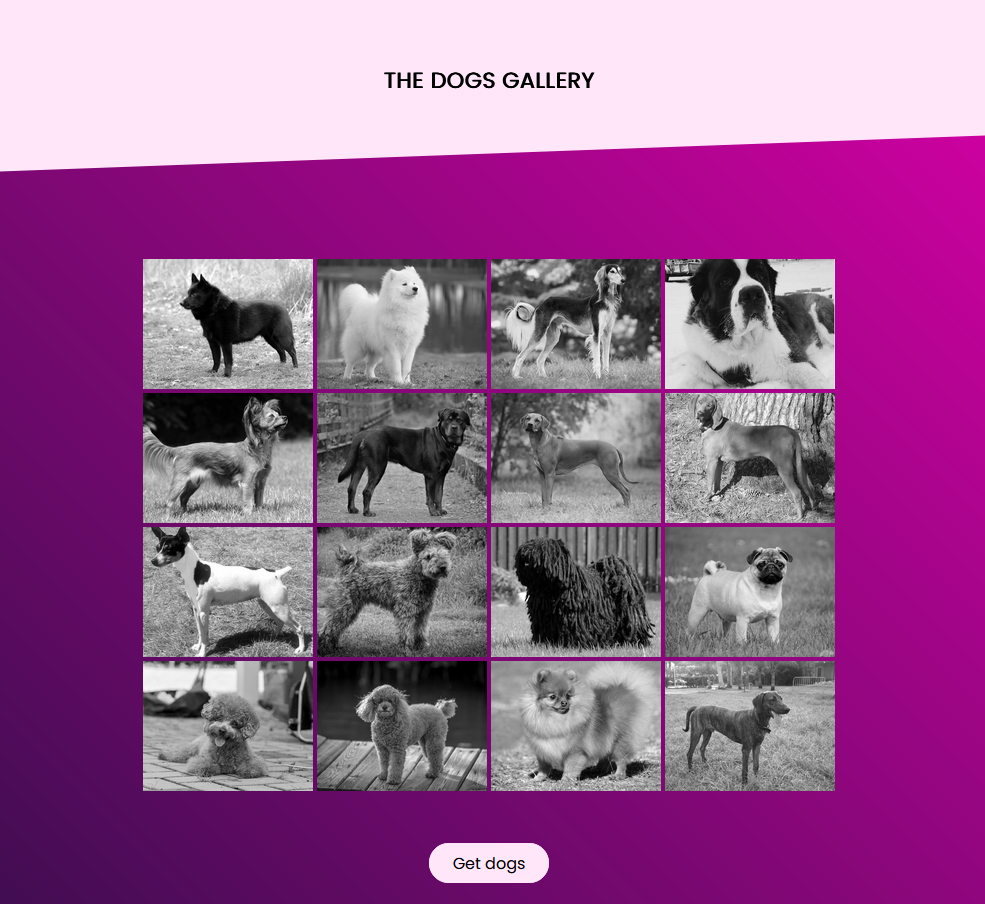
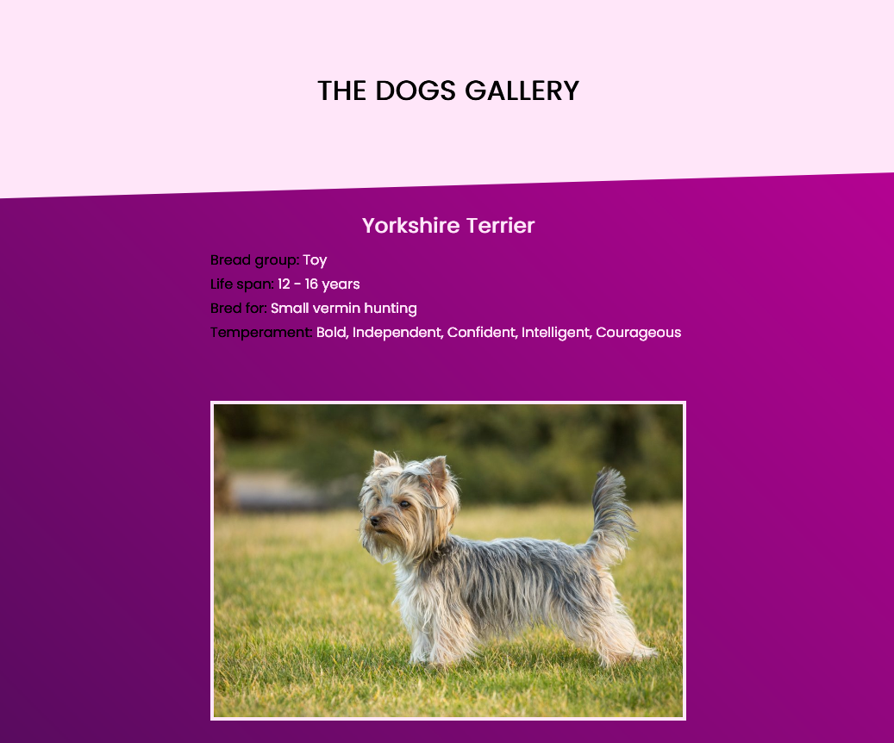

# The Dogs Gallery

Project for IP21 academy.

<a href="https://veronikagregorec.github.io/dogs-gallery">Live Preview</a>

## Browser Compatibility

All of the latest versions of <b>Chrome</b>, <b>Firefox</b>, <b>Edge</b> and <b>Opera</b> browsers are supported.

## Installation

#### Steps to install

<ol>
  <li>download the folder/git clone the repo</li>
  <li>cd root directory of the folder</li>
  <li>access localhost:5500 on your browser</li>
</ol>

## Screenshots

Homepage shows the first 15 dogs. Clicking the Get dogs button displays an additional 15 dogs (and so on).

Click on an individual dog to display the dog's information.

[Back to the top](#the-dogs-gallery)
